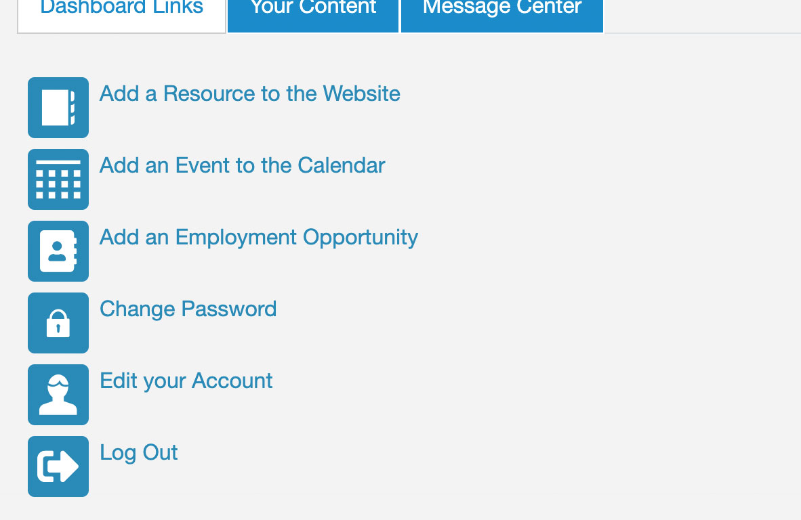

# Add an Event

## Create Event and Submit for Review

1. Log in to the site. After logging in, you'll see a list of actions you can perform.  
  

1. Select "Add an Event to the Calendar."  

1. Fill out the form. See form details below. 

1. Submit form or save a draft. 
    1. Preview: User can see what the page will look like when published. 
    1. Save as Draft: Drafts are accessible via the user's profile page. There's a tab for "your content" which lists all content you've created. Click edit to resume working on a draft. 
    1. Submit for Approval: Clicking sumbit for approval puts the resource in an approval state, sends a message to the state administrator, and drops a message in the admin's message center.  

## Form Details

1. Profile Reference: When you add an event, the user can reference a profile *if they own it*. This is what enables events to be displayed on their profile page. 

1. Event Date: Enter start (required) and end date (optional) for the event. 
    1. Want to prevent users from having an event that lasts forever. You cannot create an event that lasts longer than 5 days. 
    1. There is a custom module to fix display issues between Mac and Safari. 
    
1. Event Date > Event Time Zone: Displays the time zone where the event is located. 
    1. All Day: Ends up with strange time zone issue. Haven't been able to resolve that.  

1. Event Date > Time Zones: Select the time zones you want to display to viewers. If the event is available in multiple time zones, this allows the user to display the start time for multiple time zones (so users don't have to do math). This is a custom feature that prints out brackets with the calculated times for each time zone.
 

1. Event Location > Location Type: 
    1. The location type determines what flag shows up next to an event. There's a custom module that affects how the form works (which things are required or not). 
    1. Selecting "physical" is what makes a map be displayed on a resource page. 
    1. Physical: If physical, required to give a state. Can also add mailing address. 
    1. Virtual: If only virtual, state still required. But address is not asked. 
    1. National: Not state ownership required. 

1. Phone Number: Field accepts text, so not just phone number.