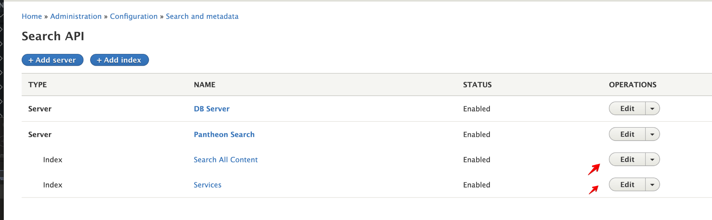

# Work on a Ticket

We're using git flow, but only specific commands. See below for workflow. If you look at a git flow page elsewhere, you'll use commands that could mess you up.

If you need to start your environment or get a new database, refer to those sections in this guide.

## Work on a Ticket

### Start a New Feature Branch

1. Checkout develop branch:  
`git checkout develop`
1. Pull code only (do not import config):  
`git pull origin develop`
1. Create a new branch (branch name cannot exceed 11 characters):  
`git flow feature start [branch-name]`
1. Import config on your new feature branch:  
`lando drush cim`
1. Work on your ticket.

### Switch to an Existing Feature Branch

1. Checkout the feature branch:  
`git checkout feature/[branch-name]`
1. Import config on the feature branch:  
`lando drush cim`
1. Work on your ticket.

## Commit Your Work

### Dos and Don'ts

Refer to the following dos and don't when making commits.

1. DO commit the composer.lock and composer.json files.
1. DO commit CSS separately from other code changes (separate from feature, etc.) and at the end, before you deploy.
1. DO commit SCSS separate from CSS to avoid merge conflicts. CSS commit should be disposable. The SCSS commit should be a keeper.

### Export and Commit

Export and commit your work regularly so that you know exactly what you've changed for each file and don't accidentally lose any work.

1. Move into the web folder, if you're not already there.
1. Export config:  
`lando drush cex`
1. Look at the status to see what's changed:  
`git status -s`
1. Diff files and add to commit:
    1. Diff each modified file to verify you do want to export those changes:  
    `git diff [file-name]`
    1. Add reviewed files to your commit:  
    `git add [file-name]`
    1. Undo changes to *tracked* files you don't want to keep:  
    `git checkout -- [file-name]`
    1. Undo changes to *untracked* files you don't want to keep:  
    `rm [file-name]`
1. Commit your work. If there’s a Jira ticket number related to your work, put that ticket number as the first info in the commit message.  
`git commit -m “[branch-name + commit message]”`

### Push to Pantheon Multidev

Push your code to Pantheon regularly as you work on a feature branch. This ensures you won't lose work if something happens to your local machine.

1. Push your code to GitHub:  
`git push origin feature/[branch-name]`
1. Go to [GitHub Actions](https://github.com/Nashville-Public-Library/npl-d8/actions) to verify your push was successful.
1. Your work will be pushed to a multidev on [Pantheon](https://pantheon.io).

### Re-index on Pantheon Multidev  

If you are working on something that could be affected by the index, you'll need to re-index the site after making the multidev. 

The following steps fix the search function in new multidev sites:   

1. Update Index 1: Search All Content  
   1. Go to Configuration > Search and Metadata > Search API  
   1. Click the Edit button next to **Search All Content**  
      
   1. Click the View tab.  
     
   1. On the Index status page, click "Clear all Index data" then click "Rebuild tracking Information".  
     
   1. The index will take some time to complete, and the "Search index status" will show you the number of the indexed content. After the index is complete, the search should return the results.

1. Update Index 2: Services  
   1.  Go to Configuration > Search and Metadata > Search API  
   1. Click the Edit button next to **Services**  
      
   1. Click the View tab.  
     
   1. On the Index status page, click "Clear all Index data" then click "Rebuild tracking Information".  
     
   1. The index will take some time to complete, and the "Search index status" will show you the number of the indexed content. After the index is complete, the search should return the results.

## Create a Pull Request for Code Review on Github

### Rebase Your branch

You DO NOT have to rebase your branch every time you push changes on your feature branch. You DO need to rebase your branch when preparing to merge if you're missing work that's on live.

1. Commit all your work on your feature branch.
1. Checkout develop (we have to rebase our feature branch off develop):  
`git checkout develop`
1. Pull code (you should be on develop branch):  
`git pull origin develop`
1. Rebase feature branch off develop (you should be on develop branch, though you can do this on the feature branch and syntax is the same):  
`git flow feature rebase [branch-name]`
1. If there are merge conflicts, resolve those:
    1. Open mergetool:  
    `git mergetool`
    1. For help with mergetool and resolving conflicts see mergetool discussion in Aten video (timestamp 18:22): *Z > Electronic Resources > reference > Web Services > Drupal Training > Aten Training_2019-08-01_CEX-CIM-workflow_and_handling-merge-conflicts*
1. Checkout feature branch if you weren't moved there after merge conflict resolution:  
`git checkout feature/[branch-name]`
    1. If you fixed merge conflicts, you may need to import config on your feature branch again (because you changed the configuration):  
    `lando drush cim`
    1. If there were merge conflicts on the lock file, you need to update the lock file on your feature branch:  
    `composer update --lock`
1. Check the status to see if there are changes to commit. If yes, commit those changes.

### Push to Pantheon

Push your code to Pantheon regularly as you work on a feature branch. This ensures you won't lose work if something happens to your local machine.

1. Push your code to GitHub:  
`git push origin feature/[branch-name]`
1. Go to [GitHub Actions](https://github.com/Nashville-Public-Library/npl-d8/actions) to verify your push was successful.
1. Your work will be pushed to a multidev on [Pantheon](https://pantheon.io).

### Create a Pull Request

When the work on the multidev is ready for review, create a pull request and ask someone to test your work before merging.

1. Go to Github: [github.com](https://github.com)
1. If you don't see a banner alerting you to create a pull request, go to the Pull Requests tab.
1. Click the button to create your pull request.
1. Fill out the description as follows:
    1. Background: Add background info here with a link to the Jira ticket.
    1. Environment: Add a link to the multidev on Pantheon.
    1. Testing: Add steps that the reviewer needs to take in order to fully do code review and testing.
1. Assign the ticket to someone for review.

## Troubleshooting a Failed Build in GitHub Actions

If the build fails, try these things:

1. Refresh the database by getting database from Pantheon.  
    1. Lando users run `lando pull` and get live database. 
    1. DDEV users follow instructions in GitHub README for repo. 

1. Do another config import and make sure there aren’t errors:  
`lando drush cim`
1. If all else fails, try -f on push. Any time you rebase after you’ve pushed, you’ll get an error b/c the branch on Github is ahead and your push will be rejected. If everything on my local is what should be there, then you can force push:  
`git push origin feature/[branch-name] -f`
